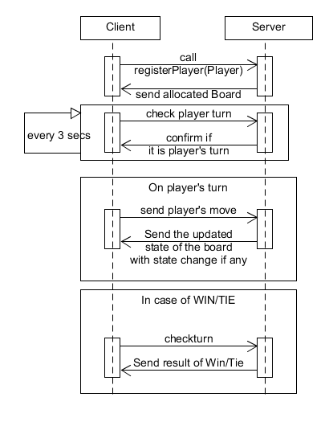
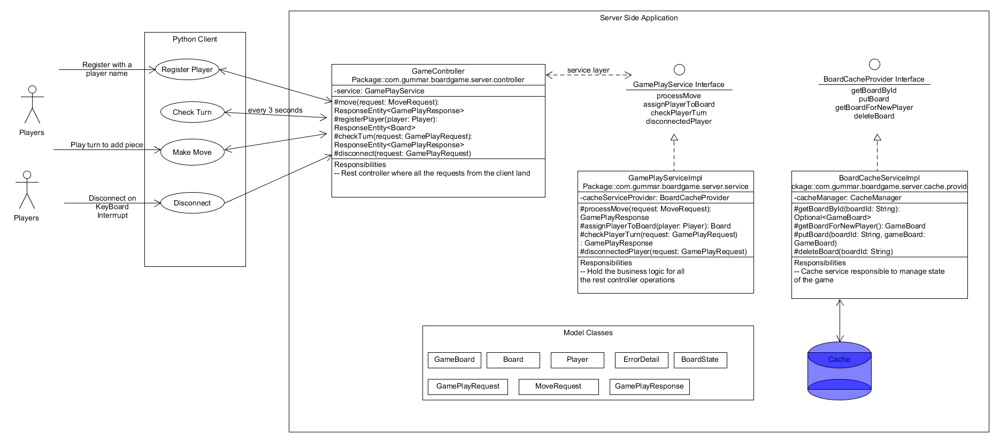

# 5-in-a-Row
## Programming Challenge: 5-in-a-Row
5-in-a-Row, a variation of the famous Connect Four game, is a two-player connection game
in which the players first choose a color and then take turns dropping colored discs from the
top into a nine-column, six-row vertically suspended grid. The pieces fall straight down,
occupying the next available space within the column. The objective of the game is to be the
first to form a horizontal, vertical, or diagonal line of five of one's own discs.

[ ][ ][ ][ ][ ][ ][ ][ ][ ]  
[ ][ ][ ][ ][ ][ ][ ][ ][ ]  
[ ][ ][ ][ ][ ][ ][ ][ ][ ]  
[ ][ ][ ][o][ ][o][ ][ ][ ]  
[ ][ ][x][x][ ][x][ ][o][ ]  
[ ][x][o][o][o][x][x][o][x]  

## When does the player win?

### Option 1
We are basically trying to find 5 points on a line.
Now there is a geometrical way of solving this by evaluating the equation for a straight line using the equation (y = mx+C)
where 
* y = y-corordinate difference or rise
* m =slope (both positive \ and negative /)
* x = x co-ordinate difference or run
* C = y-intercept

Now with a game changing the board with each turn, we can identify all the lines that can have 5 dots in the grid 6 X 9
That's 
30 horizontal lines
18 vertical lines
10 negative slopes / from the top
10 positive slopes \ from the top

So, there are atleast 68 lines that the players can drop their pieces into and win.
If we have a list of lines with cells numbered we can on each step verify if there is a win or not by verifying the lines to contain the same piece and declare a winner

### Option 2: 

Given the same grid, we can evaluate on each action using array arithmetics to work out if there are indeed 5 points on a line.
We start of with a blank board and then evaluate on a all 4 outcomes, horizontal, vertical, positive and negative slopes.
Here again, we can see that horizontal connect can start anywhere from column 1 (or zero depends how we count) and only go up until 5 (or 4). Similar subsets can be made for vertical and diagonal lines as well.

The advantage that option 2 might have over 1 is that the subset are derivable from number of pieces which in this case is 5 but can be **r**
can relatively look into the offset in an **m X n** array based on the match viz. ``cell[i-r][j]`` or ``cell[i][j-r]`` making this solution a little more extendable to test
any number of piece matches over any size 2D board.

## Implementing Option 2

For implementation, the choice was to use a SpringBoot application for server side and a python script as user console.
The state is maintained by persisting the board with relevant relationship data and state of the game play in an in-memory cache.
This solution actually extends the scope so that there can be more than one board in play at a time.

To run this sequence the following classes were designed.

## Instructions to run

Get the server and client directories from Github.

To run the server side application you need
* Java 8
* Maven 3.x

Run **mvn spring-boot:run** to launch the application

Once the application is up, capture the ip and port of the app this is needed to launch the client application

To run the client from command line you need
* python3

The client needs to be updated with the IP and Port of the server app
This should be done in client.py file under the global variable IP & PORT.
Once updated, run **python3 client.py** from terminal.
For the second player just launch it from a different terminal.

Happy Gaming!!

